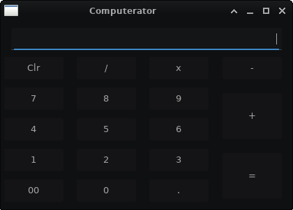
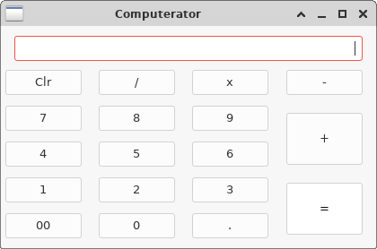

# COMPUTERATOR
#### A simple calculator example written in c++ using wxWidgets library

##### Below is a screenshot of working calculator 

The look may not be same everywhere as wxWidgets likes native widgets but it will look good on almost all platforms!

Feel free to use it anywhere.

#### Building
    mkdir build
    cd build
    cmake ..
    make

#### Running
    Computerator/computerator
